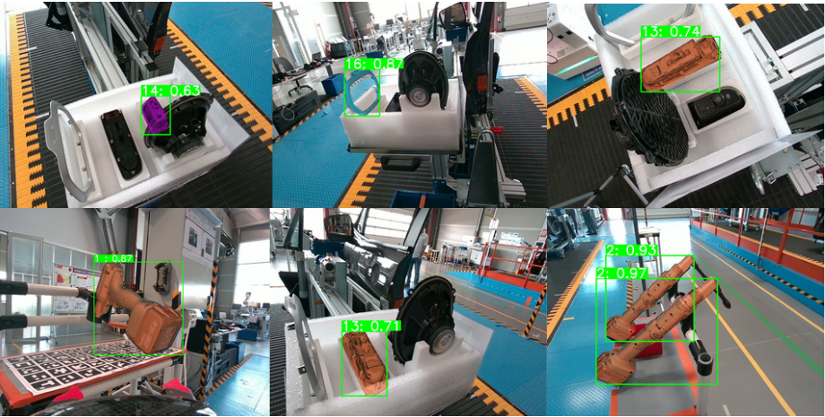
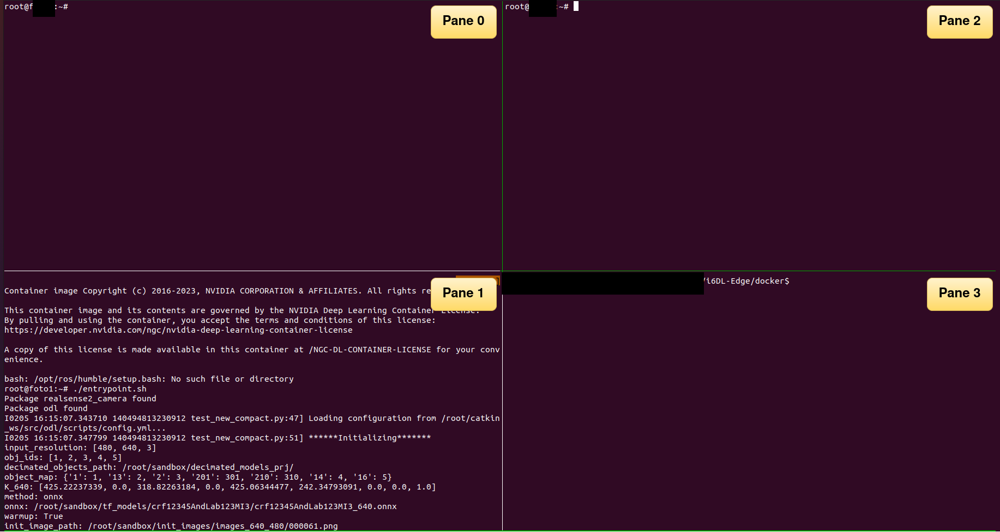

# i6DL-Edge
<p align="left">
  
</p>
The module uses as baseline method the [EPOS](https://github.com/thodan/epos) (Estimating 6D Pose of Objects with Symmetries) method, adapted as a [ROS1 service](http://wiki.ros.org/Services) for integration on robotic platforms. Moreover, optimizations for improved time performance have been integrated, as well as support for deployment in Docker containers. The module can run on **x86_64** and **aarch64/ARM** architectures using Docker containers. It receives input from an Intel RealSense camera and estimates the 6D pose for the object of interest using the camera's intrinsics. The module also supports the estimation of the 6D pose of toolstands using an ArUco-based method. 

Inference is supported:

- for the ONNX inference engine, using the trained models we provide (see section [Data](#data))

- for the TensorRT inference engine (see [TensorRT inference](#tensorrt))

# 1. <a name="data"></a> Data
You can use the [IndustryShapes dataset](https://zenodo.org/records/14616197) to test the module with our [pre-trained models](https://ntuagr-my.sharepoint.com/:f:/r/personal/psapoutzoglou_ntua_gr/Documents/FELICE/DATA_CODE_MODELS/trained_models?csf=1&web=1&e=Wda6vx). Decimated 3D models that are also required for inference can be downloaded from [here](https://ntuagr-my.sharepoint.com/:f:/r/personal/psapoutzoglou_ntua_gr/Documents/FELICE/DATA_CODE_MODELS/trained_models?csf=1&web=1&e=I0bhEt). 

# 2. Test environment
- x86: Ubuntu 20.04, [ROS Noetic](http://wiki.ros.org/noetic), [Intel RealSense D455](https://www.intelrealsense.com/depth-camera-d455/)
- aarch64: Linux 5.10.104-tegra (equivalent of Ubuntu 20.04 for NVIDIA Jetson Orin/AGX platforms), ROS Noetic, Intel RealSense D455

    
# 3. Overview
## 3.1 Dockerfiles and utility scripts
Subfolders "x86", "arm" contain Dockerfiles to build Docker images packaging the module and its dependencies for x86 and arm architectures.
- `base-<arch>`: Contains the Dockerfile and necessary files to build a base image with Ubuntu 20.04 or the aarch64 equivalent Linux 4 Tegra, OpenCV, CUDA, CUDNN and other dependencies.
- `custom-ros-<arch>`: Contains the Dockerfile and necessary files to build an image with the ROS Noetic distribution and necessary ROS packages
- `realsense-<arch>`: Builds an image with the RealSense SDK (compiled from source) and ROS packages for building the Realsense ROS node.
- `epos-<arch>`: Builds an image for installing EPOS-related libraries. 
- catkin_ws: a folder containing the source code of the module.
- `main-<arch>`: contains the Dockerfile which installs TensorRT, as well as 2 scripts.
    - `main-<arch>/prepare_ws.sh` builds a ROS package named "odl" which will run the service and installs the ROS Realsense package from source, from a patched fork that enables support for running the node in Docker on ARM .The script first checks whether odl and ROS RealSense packages are available. 
    - `main-<arch>/entrypoint.sh` calls `prepare_ws.sh` and runs the ROS service server script with `rosrun`.

The following utility scripts have been implemented to handle the module:
- `build_all.sh`: builds all the images in the following order: `base-<arch>` -> `custom-ros-<arch>` -> `realsense-<arch>` -> `epos-<arch>` -> `main-<arch>`. Run as
```
./build_all.sh <image_tag> <target_architecture>
```
where `<target_architecture>` = `x86` or `arm`

- `run_container.sh`: launches an interactive container of a Docker image. sandbox, catkin_ws as well as the host's `.bashrc` file are mounted to the container. Run as
```
./run_container.sh <image name> <image tag>
```
- `run_new.sh`: uses the docker `exec` command to launch a new session attached to the most recent running container.

- `launch_camera.sh`: Launches the RealSense ROS node for either 1280 x 720 or 640 x 480 resolutions. If a ROS node is already running and you wish to launch it for a different resolution, the script kills the ROS node and launches the correct one. It also handles the edge case of killing multiple ROS nodes which may persist. Run as 
```
./launch_camera.sh <width>
```
where "width" = 1280 or 640, in order to run for 1280 x 720 or 640 x 480 resolutions respectively.

- `init_session.sh`: Determines the architecture of the host machine and creates a tmux session with 4 panes. 
    - Pane 1: executes `./run_container.sh` which launches an interactive container for `main-x86` or `main-arm` images, depending on the architecture, and then executes `entrypoint.sh`.
    - Pane 0 & 2: executes `run_new.sh`.

<p align="left">
  
</p>
If the session already exists, it attaches to it. Run as 

```
./init_session.sh <session name> <docker image tag>
```

## 3.2 Scripts in catkin_ws/src/odl/

Scripts implementing the main functionality of the module. 
## scripts
```test_new_compact.py```: Main executable - ROS service server script. Instantiates an EPOS model, the service, camera subscribers.  

Packages Description:

- ```initialize.py```: Defines an EPOS model. Given the attributes loaded by the ```config.yaml``` file it initializes and performs warmup with the model using the chosen method (ONNX Runtime, TensorRT).
- ```inout.py```: Mostly utility functions for reading and writing operations like saving images and correspondences.
-  ```postprocessing.py```: Includes post-processing functions executed after the prediction is acquired.
-  ```profiler.py```: A class for timing different blocks of code, useful for analyzing the latency of the module.
-  ```TensorRT.py```: The TensorRT class, that initializes by loading a trt engine, creating context, initializes and predicts with the trt model.
-  ```camera.py```: Class containing camera-related tasks like callbacks to obtain image data from the camera stream and trigger the inference pipeline.
- `ToolstandDetector_stable.py`: Performs detection and localization of toolstands (see section Toolstand detection)

## msg, srv
Custom ROS messages and service definitions. Building the workspace will result in a service being built named `object_pose`.

# 4. Instructions
## 4.1 Setup

Steps that should be carried out the first time you use this repo. "Host" refers to the (physical or virtual) machine on which the Docker container will be deployed. "Root" directory refers to the repo directory (i.e. /some/path/i6DL-Edge)

1. Clone the repo: `git clone --recursive https://github.com/POSE-Lab/i6DL-Edge.git`

2. If you plan on running the rosmaster on the same host as the module, you also need to install ROS.

2. Add the following lines to `.bashrc` in the host

```
export ROS_MASTER_URI=http://<IP IN WHICH ROSMASTER/ROSCORE RUNS>:<PORT>/

export ROS_IP=<IP OF HOST>

export ROS_HOSTNAME=<IP OF HOST>
```

3. Run `source ~/.bashrc` in every terminal so that the changes will be used.

4. In the root directory create a folder named `sandbox` which will hold all necessary data (images, models, results), with the following subfolders:
    - `bop_datasets`: Folder containing datasets in [BOP format](https://github.com/thodan/bop_toolkit/blob/master/docs/bop_datasets_format.md). To run the service, the following is required: 
        - `models_cad`: PLY 3D models of the objects.
    - `decimated_models_prj`: folder with decimated 3D models
    - `tf_models`: folder to keep trained models.
    - `init_images`: Folder to include images to be used in the initialization/warmup phase when running the module. Images should be of dimensions either 1280 x 720 or 640 x 480.

Download the IndustryShapes dataset in bop_datasets (see section [Data](#data)). You can include any image from IndustryShapes in init_images. 

5. Change to `docker` directory and build the Docker images 

6. Install [tmux](https://github.com/tmux/tmux/wiki/Installing)

7. Ensure your NVIDIA driver versions are >= 418.81.07

8. Install [NVIDIA Container Toolkit](https://docs.nvidia.com/datacenter/cloud-native/container-toolkit/latest/install-guide.html) for enabling GPU support for Dockers

## <a name="run_service"></a> 4.2 Running the service

- Run rosmaster (`roscore`)

- Edit `config.yml` in catkin_ws/src/odl/scripts appropriately (please refer to the file itself for details)

- From the `docker` directory, run the `init_session.sh` script as described in Overview
 E.g. `./init_session.sh test_session latest`.

- When you run `init_session.sh` for the first time, the catkin workspace is built and sourced. After the workspace is built, execute `launch_camera.sh` in either Pane 0 or 1 to launch the RealSense ROS node.

- Request a pose: type in Pane 2 `rosservice call /object_pose` followed by tab x 2 and input the object ID (for which ID corresponds to each object refer to `config.yml`).

- The image taken from the camera, the estimated pose, and the profiling are saved as image_raw.png, pose.txt, corr_ and profiling.json respectively under `/root/sandbox/results/image_raw/Test_<timestamp>/<Object ID>`, where timestamp is the date and time the service is called. The correspondences file is stored under `/root/sandbox/results/image_raw/Test_<timestamp>/<Object ID>/corr_/<timestamp>_corr`.

## 4.3 Toolstand detection
The toolstand detection and localization should be specifically tailored for a target use case. This includes:
- Defining an origin on the toolstand 
- Changing the configuration in `config_toolstand.yaml` (e.g. ArUco grid parameters, toolstand corners according to its geometry)
- Adapting the transformations (rotation + translation) in `ToolstandDetector_stable.py` by calculating the appropriate distances to the defined origin so that the 6D pose of the ArUco board, which is on the upper left corner on the grid by default, aligns with the origin.

## 4.4 Visualization
Refer to **vis/README.md** for how to visualize the estimated poses and the detected inliers. Note that currently visualization is supported for **x86 only**, **outside** Docker. 

## <a name="tensorrt"></a> 3.5 [TensorRT](https://docs.nvidia.com/deeplearning/tensorrt/quick-start-guide/index.html) inference
A TensorRT model, or engine (also called a plan) is optimized in a way that is heavily dependent on the underlying hardware. As a result, a TensorRT model is generally not portable across different GPU architectures. For this reason, we do not provide built TensorRT models. Instead, one should build the model (engine) themselves from the provided ONNX model using `trtexec`. 

### FP16 and FP32 engine
Run 

```
/usr/src/tensorrt/bin/trtexec --onnx=/path/to/onnx/model --saveEngine=/path/to/output/engine --<precision> 

```
where `precision` = `fp16` or `fp32`

### INT8 engine
To create an INT8 engine, the pre-trained model (ONNX in this case) needs to be calibrated on a subset of the training data. After calibration, a cache file is generated, which will be used to generate the INT8 engine.

- Run the calibration script included in catkin_ws/src/odl/scripts/utils:
```
python calibrator.py --calib_dataset_loc /path/to/bop_dataset/train_folder --saveCache /output/cache/filename (calibration file) --onnx /path/to/onnx/model --img_size height width channels --num_samples num_samples --batch_size batch_size 
```
Where

`img_size`: image size of calibration images

`num_samples`: Number of samples that will be randomly selected for every object (default: 300)

`batch size`: Number of samples that will be processed in every iteration (batch size) (default: 64)

e.g.

```
python calibrator.py --calib_dataset_loc /home/i6DL-Edge-Lite/store/train_primesense --saveCache /home/i6DL-Edge-Lite/store/crf12345AndLab123MI3/crf12345AndLab123MI3_640_int8.cache --onnx /home/i6DL-Edge-Lite/store/crf12345AndLab123MI3/crf12345AndLab123MI3_640.onnx --img_size 480 640 3 --num_samples 100 --batch_size 4
```

- Build the engine:
```
/usr/src/tensorrt/bin/trtexec --onnx=/path/to/onnx/model --saveEngine=path/to/output/engine --int8 --calib=/path/to/calib/cache
```
### Inference
In the YAML configuration file, change the `method` field to `trt`, and the `trt` field to the path of the TensorRT engine you created. Run the service as described in [3.2 Running the service](#run_service).

# 5. Misc info & troubleshooting

- Killing the tmux session: Ctrl + B, type ":", then enter `kill-session` in the yellow/orange prompt.

- Detach from tmux session: Ctrl + B, then press d.

- Cleanly killing all tmux sessions: Run `tmux kill-server`.

- Changes: Any changes done in catkin_ws, the sandbox, or the .bashrc from either the host or the container are visible from both the host and the container and persist when the container stops/is killed.

    - Changes in the module .py files only require re-running the server (either run ./entrypoint.sh or just rosrun --prefix "/usr/bin/env python3" odl - test_new_compact.py).
    - Changes in config.yml require re-running the server.
    - Adding a new ROS package or changing the ROS message definition requires building the catkin workspace again with catkin_make. Please build the workspace **inside** the container.
    - Changes in either 1) any Dockerfile 2) the files in the odl folder (apart from the configuration files) 3) prepare_ws.sh 4) entrypoint.sh require running `build_all.sh` again, i.e. re-building the docker images.

